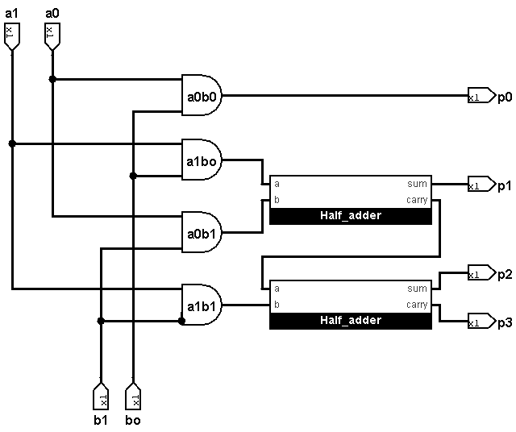
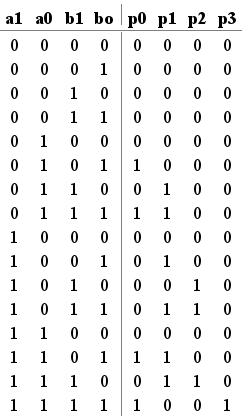

# 2×2 Binary Multiplier using Logisim Evolution

A gate-level implementation of a **2×2 Unsigned Binary Multiplier** designed using **Logisim Evolution**. This project demonstrates the fundamentals of binary multiplication by generating partial products with AND gates and adding them using Half Adders.

---

## 📖 Overview

The 2×2 Binary Multiplier multiplies two 2-bit unsigned binary numbers and produces a 4-bit output.

**Inputs**

- A1, A0 (2-bit Input A)
- B1, B0 (2-bit Input B)

**Outputs**

- P3, P2, P1, P0 (4-bit Product)

---

## ✨ Features

- Gate-level implementation
- Built using Logisim Evolution
- Uses only basic digital logic components
- No built-in multiplier component
- Easy to understand and verify
- Suitable for Digital Electronics and VLSI beginners

---

## 🛠 Components Used

| Component | Quantity |
|-----------|---------:|
| AND Gates | 4 |
| Half Adders | 2 |
| Input Pins | 4 |
| Output Pins | 4 |

---

## ⚙️ Working Principle

The multiplication process consists of two stages.

### Stage 1: Partial Product Generation

Each bit of input **A** is multiplied with each bit of input **B** using AND gates.

```
PP0 = A0 × B0

PP1 = A1 × B0

PP2 = A0 × B1

PP3 = A1 × B1
```

### Stage 2: Partial Product Addition

The generated partial products are added using two Half Adders.

- Half Adder 1
  - Inputs: PP1, PP2
  - Outputs: P1, Carry

- Half Adder 2
  - Inputs: Carry, PP3
  - Outputs: P2, P3

The least significant bit (P0) is directly obtained from PP0.

---

## 📂 Repository Structure

```
Binary-Multiplier-2x2/
│
├── circuit/
│   └── multiplier_2x2.circ
│
├── docs/
│   ├── Theory.md
│   ├── Design.md
│   └── Results.md
│
├── screenshots/
│   ├── half_adder.png
│   ├── multiplier_2x2.png
│   └── truth_table.png
│
└── README.md
```

---

## 🖼 Circuit Diagram



---

## 📊 Sample Verification

| Input A | Input B | Output |
|:------:|:------:|:------:|
| 11₂ | 11₂ | 1001₂ |

Decimal Verification

```
3 × 3 = 9
```

---

## 📈 Simulation

The circuit was tested using **Logisim Evolution**.

✔ Successfully verified for all **16 input combinations**.

Truth Table:



---

## 📚 Documentation

Detailed documentation is available in the **docs** folder.

- Theory
- Design
- Results

---

## 🚀 Future Updates

This repository will be updated with:

### Verilog HDL

- [ ] Half Adder
- [ ] Full Adder
- [ ] 2×2 Binary Multiplier
- [ ] Testbench
- [ ] Simulation Waveforms

**Status:** 🚧 Coming Soon

---

## 🔜 Upcoming Projects

This project is the first step in a multiplier design series.

- [ ] 4×4 Array Multiplier
- [ ] Booth Multiplier
- [ ] Wallace Tree Multiplier

---

## 💻 Software Used

- Logisim Evolution

---

## 🎯 Learning Outcomes

After completing this project, you will understand:

- Binary Multiplication
- Partial Product Generation
- Half Adder Design
- Combinational Logic Design
- Gate-Level Circuit Implementation
- Digital Logic Fundamentals

---

## 🤝 Contributing

Contributions, suggestions, and improvements are welcome. Feel free to fork this repository and submit a pull request.
 

---

## 👨‍💻 Author

**Man Modi**

Electronics and Communication Engineering Student

Learning Digital Logic • Verilog HDL • FPGA • VLSI Design
